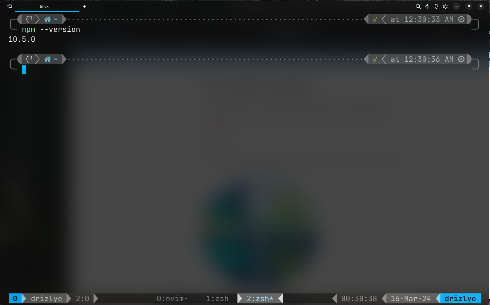
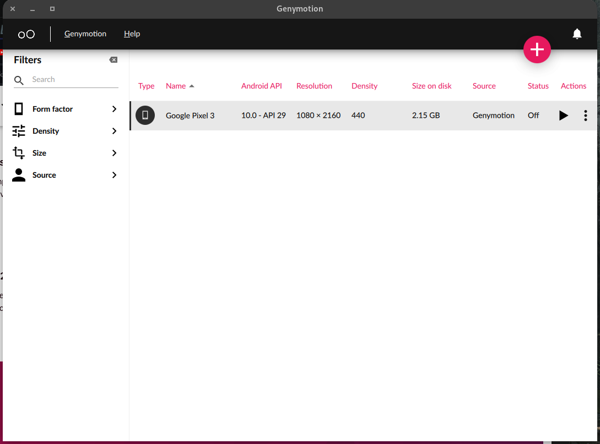
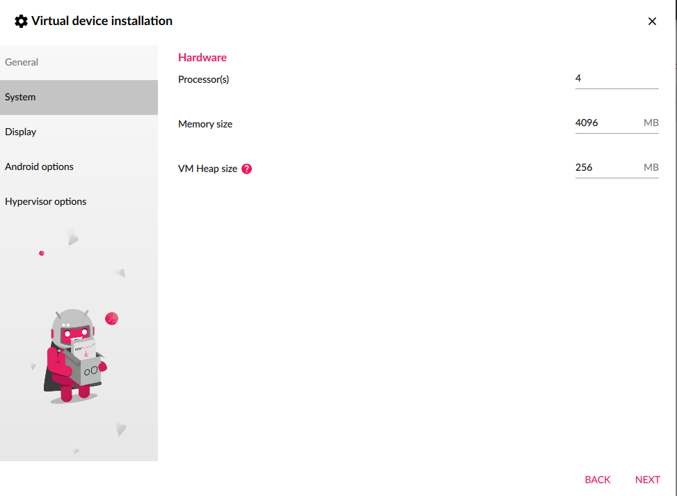

# Proyecto Fisica/iOS 2024
## Documentacion

**Para el desarrollo de este proyecto se necesitara:**
1. NodeJS/npm
2. Genymotion
3. Editor de codigo/IDE
4. Terminal(CMD/Powershell)
5. Git

## Node/npm

**Instalar NodeJS junto a npm** 

- Ir a https://nodejs.org/en/
- Descargar el instalador para tu sistema(Windows/Linux/MacOS).
- Ejecutar el instalador y seguir los pasos.
- Una vez terminado ejecutar tu powershell/cmd/zsh/bash y escribir los siguientes comandos.

## Genymotion(Android Emulator)

**Instalar Genymotion Desktop**

- Ir a https://www.genymotion.com/product-desktop/
- Descargar el instalador de Genymotion para tu sistema
- Instalar Genymotion y abrirlo 
- Necesitaras logearte con tu account, si no tienes podras crear una 
- Crear e instalar una version de android pulsando el + (recomiendo usar google pixel 3 con android 10)

- Si lo deseas puedes limitar la cantidad de ram y nucleos de procesador que usara genymotion para virtualizar android

