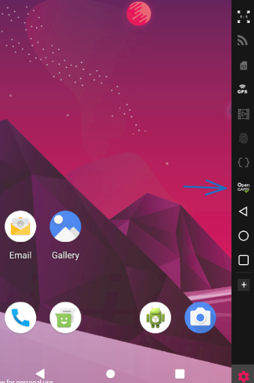
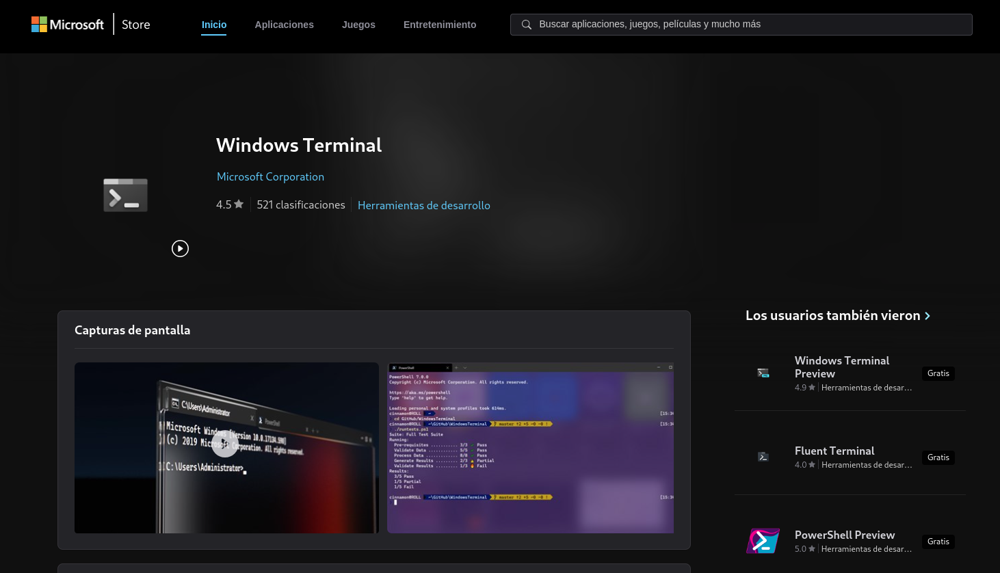
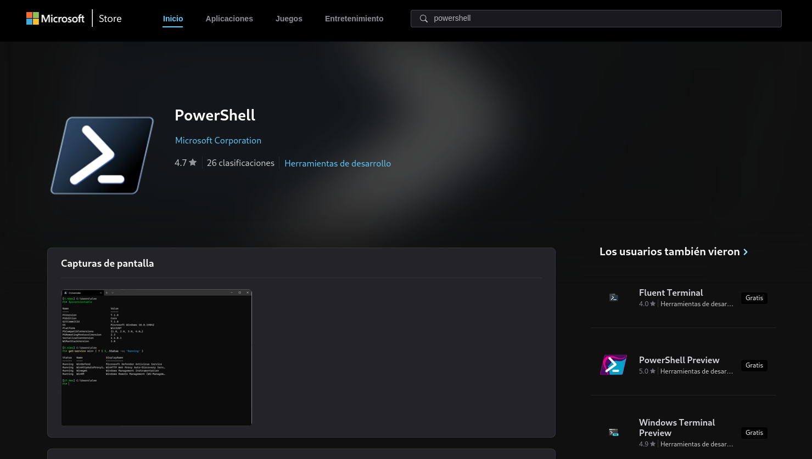

# Proyecto Fisica/iOS 2024
## Documentacion

**Para el desarrollo de este proyecto se necesitara:**
1. NodeJS/npm
2. Genymotion
3. Android Studio
4. Editor de codigo/IDE
5. Terminal(CMD/Powershell)
6. Git/GitHub

## Node/npm

**Instalar NodeJS junto a npm** 

- Ir a https://nodejs.org/en/
- Descargar el instalador para tu sistema(Windows/Linux/MacOS).
- Ejecutar el instalador y seguir los pasos.
- Una vez terminado ejecutar tu powershell/cmd/zsh/bash y escribir los siguientes comandos.

## Genymotion(Android Emulator)

**Instalar Genymotion Desktop**

- Ir a https://www.genymotion.com/product-desktop/
- Descargar el instalador de Genymotion para tu sistema
- Instalar Genymotion y abrirlo 
- Necesitaras logearte con tu account, si no tienes podras crear una 
- Crear e instalar una version de android pulsando el + (recomiendo usar google pixel 3 con android 10)

- Si lo deseas puedes limitar la cantidad de ram y nucleos de procesador que usara genymotion para virtualizar android

- Activar los servicios de google para el uso de maps

## Android Studio

**Instalar Android Studio(Recomendado)**
- Ir a https://developer.android.com/studio y seguir el proceso  de instalacion para tu sistema

**Instalar solo el SDK y ClI SIN ANDROID STUDIO**

- En el mismo enlace el parte de abajo se encuentran las cli-tools si no quieres instalar android studio(no lo recomiendo ya que es mas sencillo usar el sdkmanager incluido en android studio)

## Editor de codigo/IDE

Recomiendo usar Vscode para este proyecto por la ventaja de ser muy facil de instalar y de usar pero puedes usar el editor/ide de tu preferencia

## Terminal(shell)

**Windows**

Para este proyecto recomiendo tener un conocimiento basico de la terminal, si estas en windows es recomendado usar powershell y la terminal oficial de window en su tienda

Tambien recomiendo usar la powershell que se encuentra en la tienda ya que la default de windows puede dar errores

**Linux/MacOS**

En Linux/MacOS puedes usar la shell de tu preferencia (bash/zsh/fish).
Asegurate de tener el PATH de Android Studio en tu shell(solo en linux)

PATH

- export ANDROID_HOME=$HOME/Android/Sdk
- export PATH=$PATH:$ANDROID_HOME/emulator
- export PATH=$PATH:$ANDROID_HOME/platform-tools

## Git y GitHub

### Git

Descargar Git en tu sistema

**Windows**
- Descargar e instalar git (https://git-scm.com/download/win)

**Linux**
- Descargar git desde tu package manager (apt/dnf/pacman)

**MacOS**
- Descargar git desde HomeBrew (brew install git)

### GitHub

- Crearte una cuenta si no la tienes
- Clonar el repositorio ( git clone https://github.com/drizlye0/doxer-app.git -> pegar esto en tu shell)
